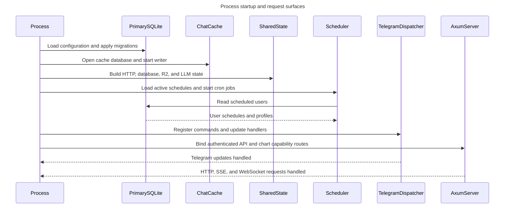
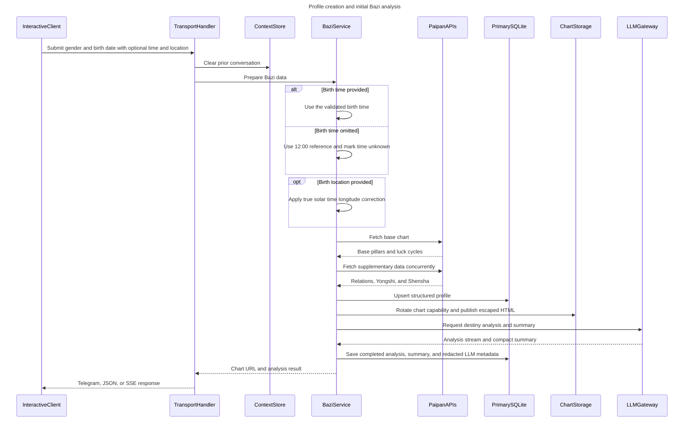
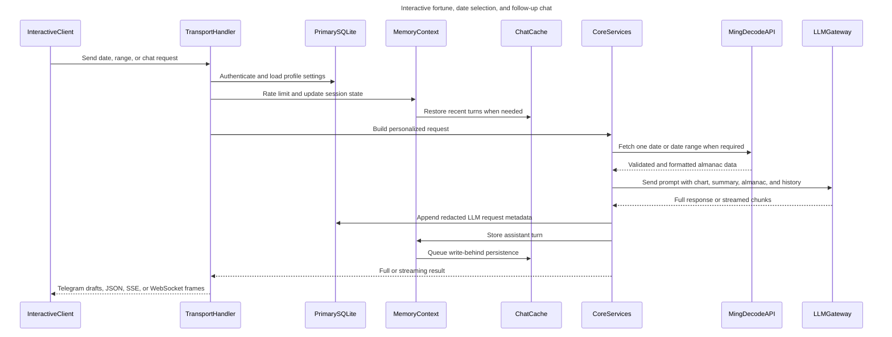
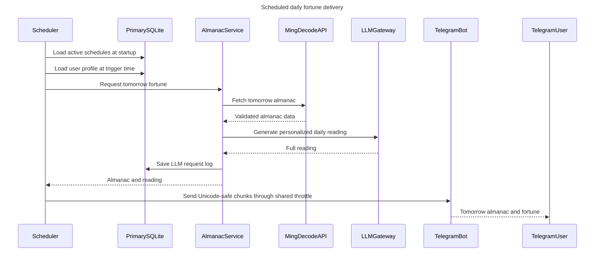
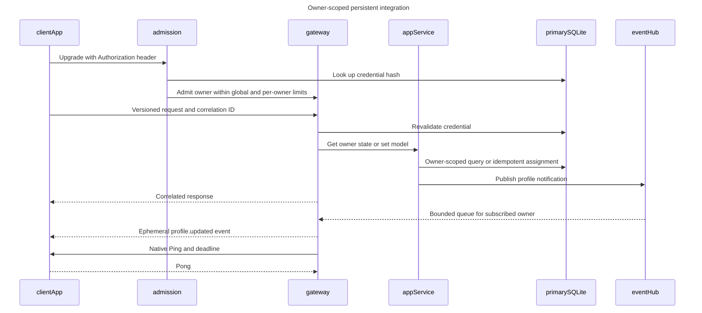
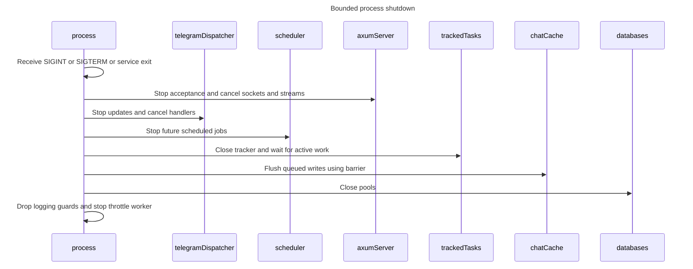

# BaziFlowAgent project flow

This document reflects the effective working tree reviewed on 2026-09-11. It covers process startup, profile creation, interactive readings/chat, and scheduled daily delivery.

## 1. Process startup and request surfaces

The process also starts log/context cleanup jobs and runs both request surfaces until graceful shutdown. The scheduler owns a `Bot` instance for centrally throttled scheduled Telegram delivery; it does not route scheduled messages through the update dispatcher.

## 2. Profile creation and initial Bazi analysis

`InteractiveClient` represents either a Telegram user or an authenticated API client. `TransportHandler` represents the relevant teloxide handler or Axum endpoint. Birth time and birth location can both be omitted. An omitted time uses 12:00 only as a date-safe reference for the required upstream chart calculation; the stored profile marks the time as unknown, and consumers are warned that the reference hour pillar is uncertain. An omitted location receives no longitude correction. `ChartStorage` is Cloudflare R2 when configured and the local `public/` directory otherwise.

## 3. Interactive fortune, date selection, and follow-up chat

Almanac retrieval applies to daily-fortune and date-selection requests. Follow-up chat skips that call and uses the stored structured chart, compact Bazi summary, and recent conversation turns.

## 4. Scheduled daily fortune delivery

The same scheduler also expires stale in-memory contexts and removes old log files on configured cron expressions.

## 5. Persistent third-party gateway

The gateway has no Telegram command passthrough. Its fixed capabilities are owner state reads, model assignments, and profile notifications. Invalid actions cannot select another owner/chat. Queue saturation cancels the slow connection; publisher work never awaits a subscriber. `/api/v1/date-fortune` remains a separate, bounded, single-reading compatibility protocol. See [protocol and limits](websocket-integration.md).

## 6. Shutdown and cleanup

Shutdown has a configured total drain deadline. Deadline expiry is logged and remaining service tasks are aborted as the runtime exits. In-memory contexts that are processing cannot be expired by cleanup. Telegram detached profile/selection work retains its admission guard until completion. HTTP streaming holds admission until its body finishes or is dropped. LLM producers stop on receiver cancellation, shutdown, output limit, or blocked-send deadline. Completed-stream acknowledgement is required before saving an analysis or sending success. HTTP schedule updates apply immediately through the shared scheduler.

Local chart retrieval resolves a 256-bit capability token to its owner in SQLite and serves the corresponding escaped HTML with no-store and no-referrer headers. It does not expose the filesystem directory. Caches are disposable; oversized history turns and full cache queues are rejected observably.

## Maintenance rule

When a code change affects any entry point, handler, service, external API, datastore, chart storage path, streaming protocol, scheduler job, or response path, update the affected sequence above in the same change. Add a new focused sequence when an independent flow cannot be represented accurately in an existing one.
